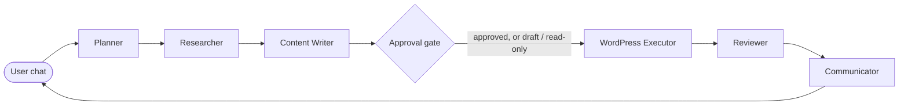

# WordPressGenius

WordPressGenius is a LangGraph multi-agent operator for WordPress and WooCommerce. You chat in plain English. It plans the work, drafts the content, and asks before it touches anything live. Drafts are free. Publishes, updates, deletes, settings, plugin changes, and refunds wait for explicit approval. Before a gated write runs, it saves a JSON snapshot of whatever it is about to change.

## Clone

```bash
git clone https://github.com/DannyBarren/WordPressGenius.git
cd WordPressGenius
```

## Quick start

You need Python 3.10 or newer. Then:

```bash
python launch.py
```

That is the whole quick start. `launch.py` installs the Streamlit bootstrap if it is missing, opens a setup screen in your browser, installs `requirements.txt`, verifies the app modules import, runs two readiness tests, then opens the chat UI at `http://localhost:8501`.

Manual equivalent:

```bash
pip install -r requirements.txt
streamlit run app.py
```

## First run

Login is on by default. Copy the example users file and sign in:

```bash
cp config/users.example.yml config/users.yml
```

The example password is `change-me`. Change it before you expose the app to anyone:

```bash
python -c "from core.security import hash_password; print(hash_password('your-new-password'))"
```

Put the new hash in `config/users.yml`. Roles are `viewer`, `editor`, and `admin`.

Then connect a WordPress site. In WordPress: Users → Profile → Application Passwords → create one. In the app sidebar: site URL, username, Application Password. Click "Test WordPress connection". Saved sites are encrypted on disk with Fernet. Set `CREDENTIAL_ENCRYPTION_KEY` in `.env` so the encryption key survives restarts:

```bash
python -c "from core.security import generate_fernet_key; print(generate_fernet_key())"
```

## The crew

Six agents, one LangGraph graph (`agents/crew.py`):



- **Planner** turns your message into a short list of structured actions. LLM when a key is configured, rule-based fallback when it is not.
- **Researcher** checks the WordPress connection, pulls site context and memory, and can run a read-only DuckDuckGo search for external facts.
- **Content Writer** drafts Gutenberg-compatible copy for new posts and pages.
- **WordPress Executor** enforces the approval gate, snapshots backups, then runs approved actions through the REST API.
- **Reviewer** checks what the API actually returned.
- **Communicator** tells you what happened in plain English.

## Hard rules

These are enforced in `core/safety.py`. They are code, not prompts.

- Draft create runs without extra approval.
- Publish, update, delete, settings, theme, plugin, SEO, bulk price, WooCommerce writes, and Stripe refunds require approval.
- Before a gated write, `tools/backups.py` reads the current resource and writes a JSON snapshot to `data/backups/`. If the resource cannot be read, the snapshot records that.
- Credentials are redacted before anything hits memory, the activity log, or the audit log (`core/logging_config.py`).

The LLM never decides what is safe. The SafetyLayer is deterministic Python. The Executor's LLM pre-flight check is advisory only — it can flag a concern, it cannot skip a gate.

## LLM providers

Works with no API key. You get the rule-based planner and template copy.

Add one key and every agent uses it. Supported providers: OpenAI, Anthropic, Groq, Google Gemini. Groq and Gemini run through their OpenAI-compatible endpoints, so there are no extra SDKs. Pick the provider in the sidebar or in `.env`:

```bash
LLM_PROVIDER=openai
OPENAI_API_KEY=your-key
OPENAI_MODEL=gpt-4o-mini
```

Cost-aware routing is built in. Planner, Researcher, Executor pre-flight, and Reviewer run on a cheap fast tier. Content Writer runs on the premium tier. Override with `LLM_FAST_MODEL` / `LLM_PREMIUM_MODEL`.

## What it can do

- Create draft posts and pages. Update or delete content after approval.
- WooCommerce: read products, orders, categories, tags, variations, low stock, and redacted customer data. Create, update, delete products, set stock, change order status, and run bulk price/stock/status changes after approval.
- Stripe through the WooCommerce gateway: read status and transactions, process refunds after approval. It never needs your Stripe secret key.
- Plugin framework: `PLUGIN_READ` (read-only) and `PLUGIN_ACTION` (approval-gated) for WooCommerce, Elementor, Yoast/Rank Math, Wordfence/Sucuri/Solid, Gravity Forms/WPForms/CF7, UpdraftPlus/LiteSpeed/WP Rocket, and ACF.
- Undo the last supported change from the latest JSON snapshot: posts, pages, settings, WooCommerce products/orders, and plugin activation status.
- Long-term memory in `data/site_memory.json` with TF-IDF recall into the Researcher.
- Multi-site vault, per-user login, hash-chained audit log, per-user rate limiting, prompt guardrails.

## Stack

From `requirements.txt`:

- Streamlit — UI
- LangGraph — agent graph
- OpenAI and Anthropic SDKs — LLM providers (Groq and Gemini via OpenAI-compatible endpoints)
- requests, pydantic, python-dotenv — WordPress REST client and config
- duckduckgo-search, langchain-community — Researcher web search
- FastAPI, uvicorn — health endpoint (`health.py`)
- cryptography — Fernet credential and site vaults
- PyYAML — login users file
- redis — reserved for a future shared session/memory backend
- beautifulsoup4, python-slugify — content helpers
- sentry-sdk — optional error tracking, PII disabled
- pytest, responses, pip-audit — tests and dependency auditing

## Tests

```bash
pytest -q
```

`pytest.ini` sets `testpaths = tests`. The suite mocks the WordPress REST API with `responses`. No live site needed. It covers the safety gates, backups, undo, LLM routing, the plugin framework, memory, auth, and the REST client.

## Docker

`Dockerfile` and `docker-compose.yml` are included:

```bash
docker compose up --build -d
```

Streamlit UI on port 8501, FastAPI health on 8081, Redis alongside. See `PRODUCTION.md` for secrets, reverse proxy, and backup notes.

For a local WordPress + WooCommerce test stack (MariaDB, WordPress on `http://localhost:8080`, WP-CLI installer):

```bash
docker compose -f docker-compose.test.yml up
```

## Limitations

- Single-user local app. It is not a hosted multi-tenant SaaS.
- Role checks are coarse. They use the WordPress roles from `users/me`, plus capability checks when the site exposes them.
- Undo does not cover every WooCommerce or plugin write. Refunds are irreversible once Stripe processes them. Verify big rollbacks on a staging site.
- Analytics summaries depend on what installed plugins expose over REST.

## What this is evidence of

- LangGraph multi-agent orchestration with structured state between nodes.
- A deterministic safety layer. Approval, backup, and permission decisions live in Python, not in the model.
- WordPress REST and WooCommerce (`wc/v3`) tooling with backups and undo.
- A mocked pytest suite that runs without a live WordPress site.

## License

MIT. See `LICENSE`.
